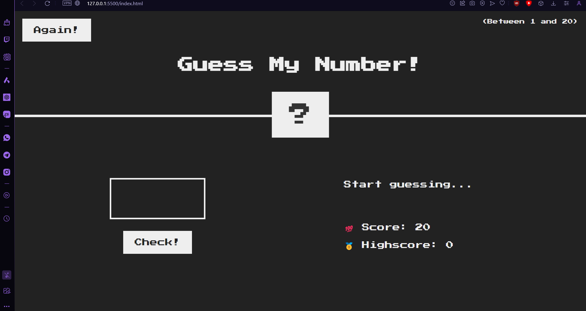

# Guess My Number Game

Welcome to the "Guess My Number" game! Test your guessing skills and try to find the hidden number between 1 and 20.

## Table of Contents

- [Game Overview](#game-overview)
- [How to Play](#how-to-play)
- [Demo](#demo)
- [Installation](#installation)
- [Game Controls](#game-controls)
- [Author](#author)
- [License](#license)

## Game Overview

In this simple web-based game, the computer selects a secret number between 1 and 20, and your objective is to guess the correct number. The game provides feedback on your guesses and keeps track of your score. Try to achieve the highest score possible and beat your previous records!

## How to Play

1. Open the game in your web browser by opening the `index.html` file.
2. The game will present a random number between 1 and 20 as the secret number.
3. Enter your guess into the input field and click the "Check!" button.
4. The game will provide feedback on your guess:
   - If your guess is correct, you win the game!
   - If your guess is too high, the game will inform you and reduce score by 1.
   - If your guess is too low, the game will also inform you and reduce score by 1.
   - If you run out of attempts (score reaches 0), you lose the game.
5. To play again, click the "Again!" button.

## Demo

For a live demonstration, you can play the game [here](insert-game-link-here).

## Installation

1. Clone this repository or download the ZIP file.
2. Open the `index.html` file in your web browser to start playing.

## Game Controls

- Input Field: Enter your guess.
- "Check!" Button: Submit your guess for evaluation.
- "Again!" Button: Restart the game.

## Author

- [Anirban Saha](https://github.com/TheFastest599)

## License

This project is licensed under the [MIT License](LICENSE).
